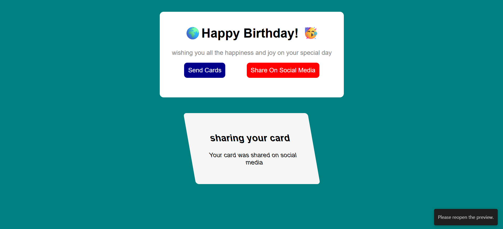

# 🎂 Birthday Card Project

This is a simple **Birthday Card Website** built with **HTML** and **CSS**.  
The project demonstrates the use of:

- ✅ Basic HTML structure (headings, paragraphs, links, sections)  
- ✅ CSS styling (colors, backgrounds, border-radius, shadows)  
- ✅ Pseudo-elements (`::before`, `::after`) to add emojis around the heading  
- ✅ Pseudo-classes (`:hover`, `:target`) for animations and interactions  
- ✅ Responsive design concepts (centered card, scaling hover effects)  

---

## ✨ Features

- 🎉 Stylish birthday card layout  
- 🖱️ Hover animations for buttons  
- 🌍 Emojis automatically added before and after the title  
- 🎯 Clicking **Send Cards** or **Share On Social Media** reveals hidden sections (CSS-only trick using `:target`)  
- 📱 Works on mobile and desktop  

---

## 📸 Screenshot

Here’s an example screenshot of the project:




---

## 🚀 How to Run

1. Clone this repository:  
   ```bash
   git clone https://github.com/your-username/birthday-card.git
